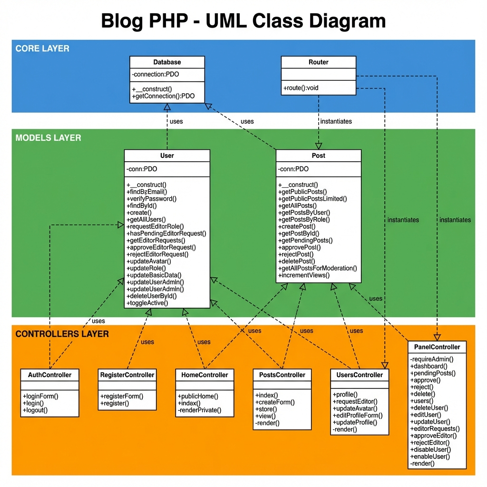
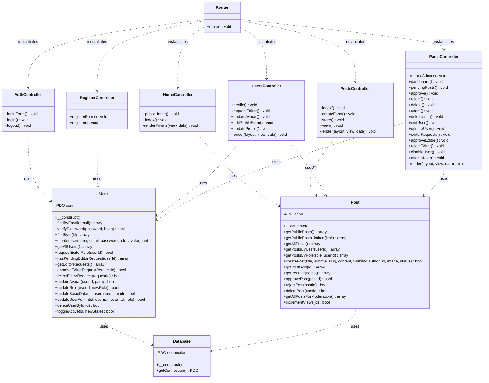
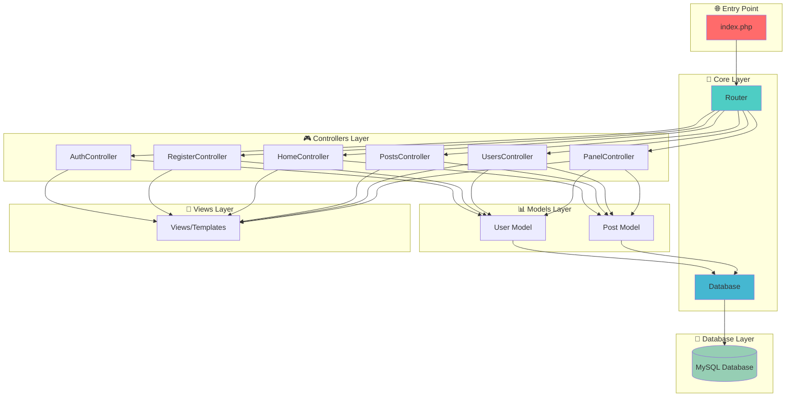
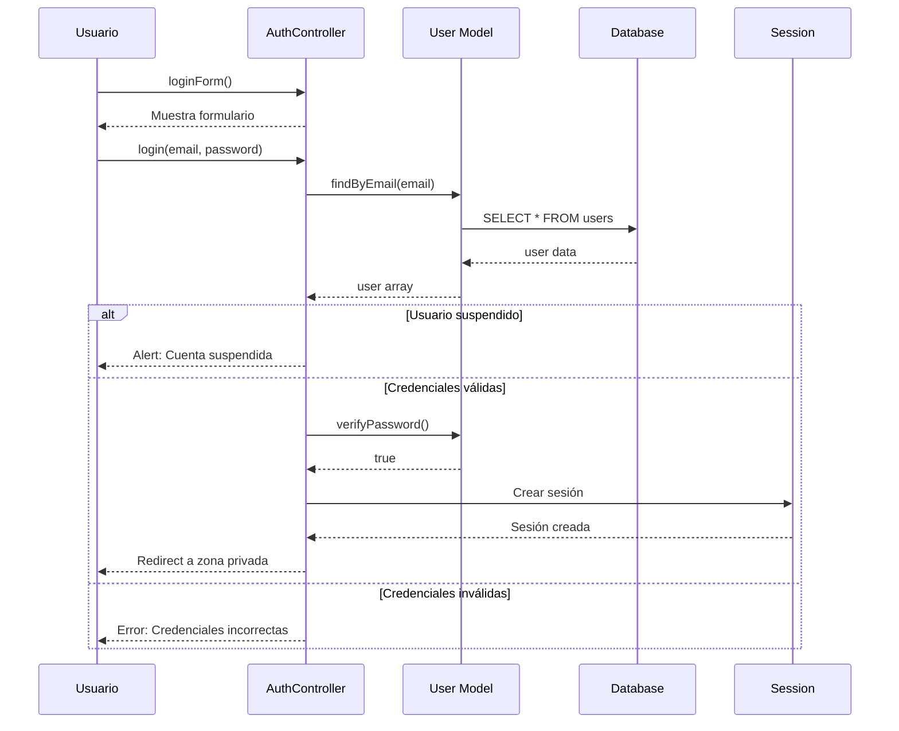
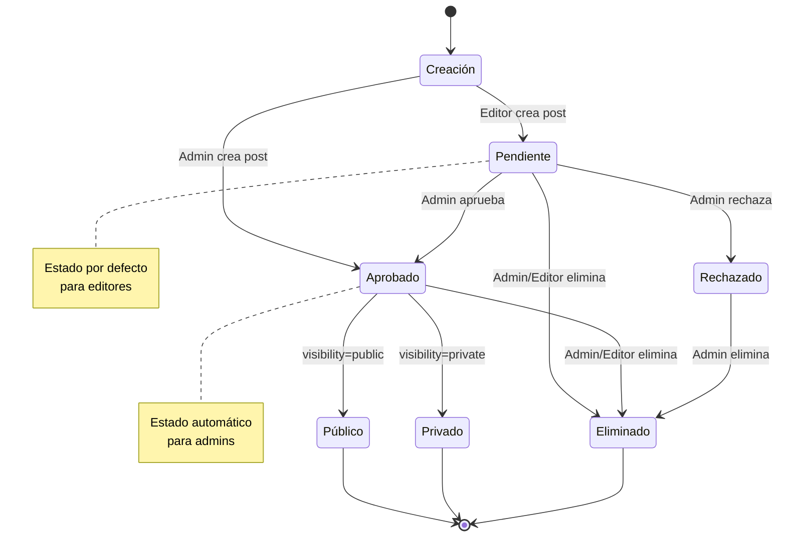
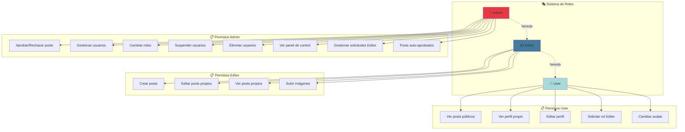
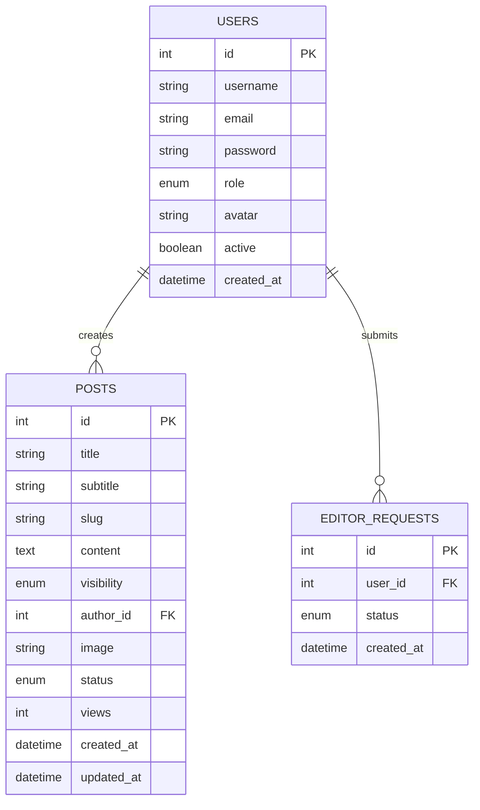
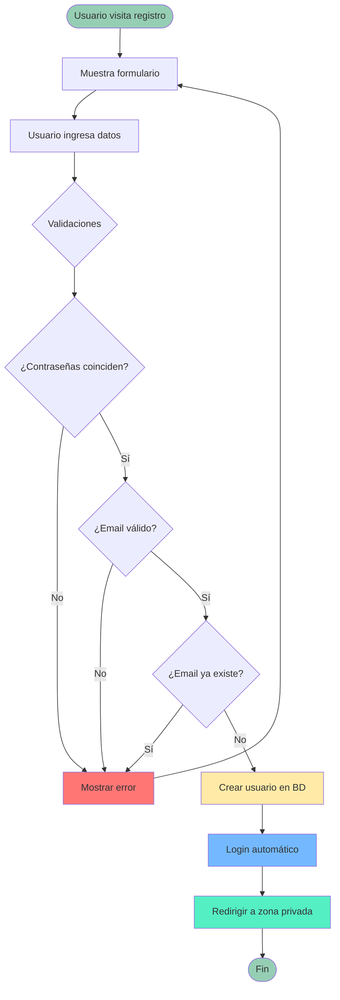
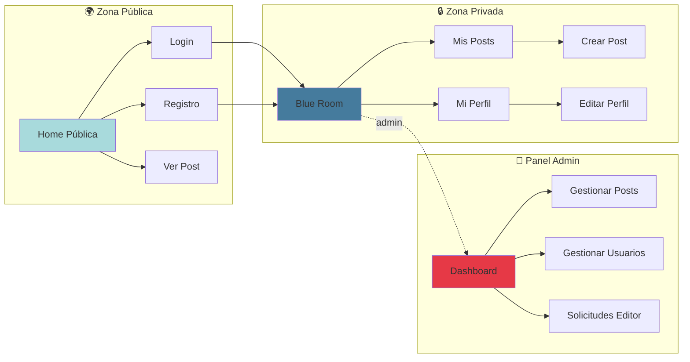

# 📐 Diagrama UML Completo - Blog PHP

> [!NOTE]
> Este documento contiene los diagramas UML completos de tu proyecto Blog PHP, incluyendo todas las clases, métodos, propiedades y relaciones entre componentes.

---

## 🎨 Diagrama de Clases Visual

---

## 🎯 Diagrama de Clases Completo del Sistema

Este diagrama muestra la arquitectura completa del sistema con todas las relaciones entre modelos, controladores y componentes core.

---

## 🏗️ Diagrama de Arquitectura MVC

Este diagrama muestra cómo se organiza el patrón MVC en tu aplicación.

---

## 🔐 Diagrama de Flujo de Autenticación

---

## 📝 Diagrama de Gestión de Posts

---

## 👥 Diagrama de Roles y Permisos

---

## 🗄️ Diagrama de Entidades de Base de Datos

---

## 🔄 Diagrama de Flujo de Registro

---

## 📊 Resumen de Componentes

### 🎯 Core (2 clases)
- **Database**: Gestión de conexión PDO a MySQL
- **Router**: Enrutamiento dinámico de controladores y acciones

### 📦 Models (2 clases)
- **User**: 17 métodos para gestión completa de usuarios
- **Post**: 14 métodos para gestión completa de publicaciones

### 🎮 Controllers (6 clases)
- **AuthController**: Autenticación (3 métodos)
- **RegisterController**: Registro de usuarios (2 métodos)
- **HomeController**: Páginas principales (3 métodos)
- **PostsController**: Gestión de posts (5 métodos)
- **UsersController**: Perfil de usuario (6 métodos)
- **PanelController**: Panel administrativo (15 métodos)

### 📈 Estadísticas del Proyecto
- **Total de clases**: 10
- **Total de métodos públicos**: 51
- **Total de métodos privados**: 4
- **Líneas de código**: ~1,200 (aproximado)
- **Patrón de diseño**: MVC (Model-View-Controller)

---

## 🎨 Diagrama de Componentes Visuales

---

> [!TIP]
> **Cómo usar estos diagramas:**
> - Los diagramas están en formato Mermaid y se renderizan automáticamente en GitHub, VS Code y muchas otras plataformas
> - Puedes copiar cualquier diagrama a tu documentación
> - Los colores ayudan a identificar diferentes capas de la arquitectura

> [!IMPORTANT]
> **Arquitectura del Proyecto:**
> - Sigue el patrón **MVC** estrictamente
> - Separación clara entre **lógica de negocio** (Models), **control de flujo** (Controllers) y **presentación** (Views)
> - Sistema de **roles jerárquico**: User → Editor → Admin
> - **Seguridad**: Validación de sesiones, sanitización de inputs, prepared statements PDO
